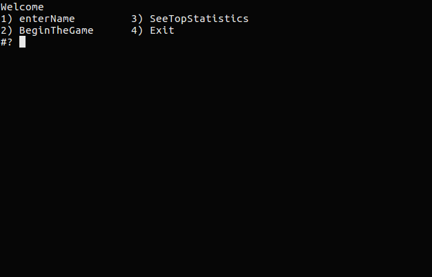
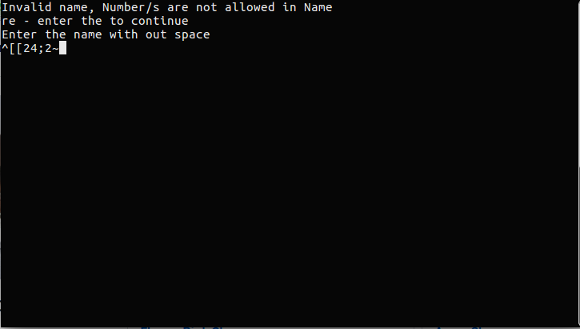
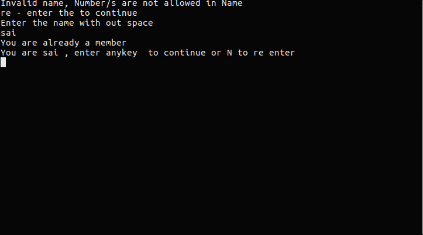
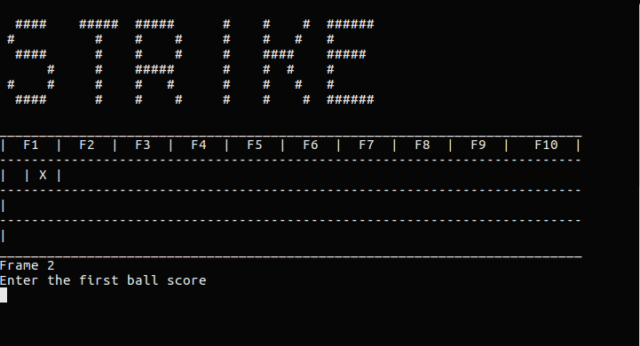
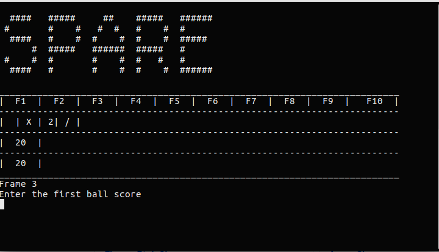
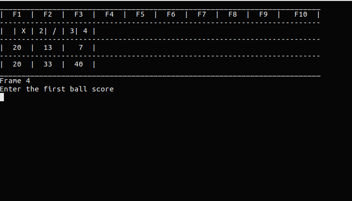
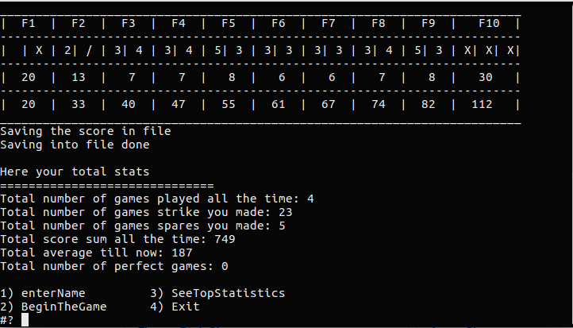
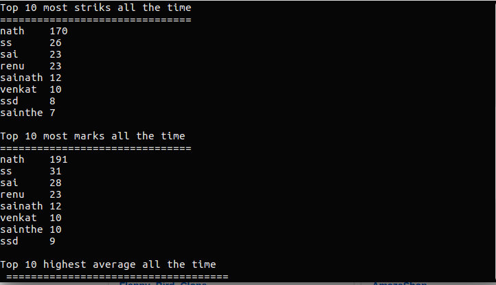

# Bowling Score Calculator using shell script 

This is simple bash/ksh shell script that will calulates the 10 pin bowling score
Inside the script - *grep,  awk,  sort, head, cat, banner* are used 
This script create two files bowlers.txt and stats.txt
- bowlers.txt
	- In this file every game statstics are appends 
	- format of file : * player-name date-time game-frame total-score*
- stats.txt
	- In this file totals stats of player re saved
	- format of file  : *playe-name total-strikes total-spares totals-marks  total-scoresum games-count average-score total-perfectgames*

In some operating system banner is no installed by default 
Banner is used to show the alerts like strike , spare 

For ubuntu like operting systems , install banner using below command

``sudo apt-get install sysvbanner``

####Screenshots:

1.starting of the shell script 

2.If you enter begingTheGame with out entering the name it will gives error message 

3.Now enter the name 
 **Conditions**
 *The name shouldn't contain any numbers, and space , and empty name *
 

4.After enter you name its gives you are previous player or new one by searching your name in bowlers.txt file

5.And ask you to conform the name 

6.Begin the game 
	- shows error if you enter worng score 
	- for strike you can enter 10 or X or x
	- for spare you can enter /

